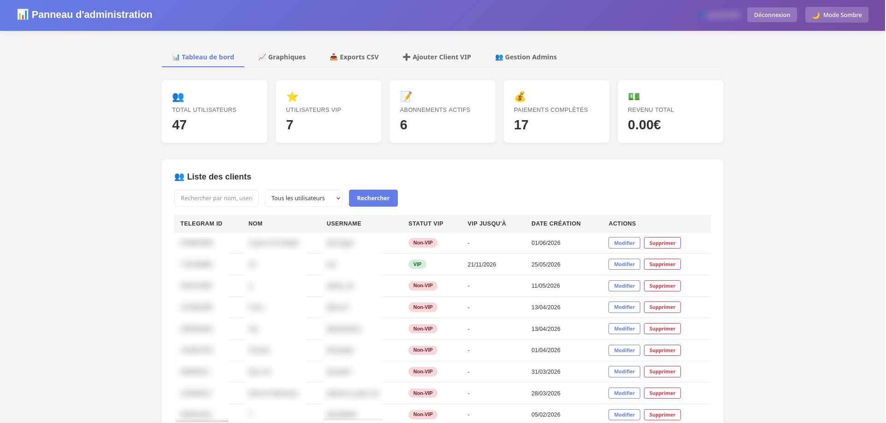
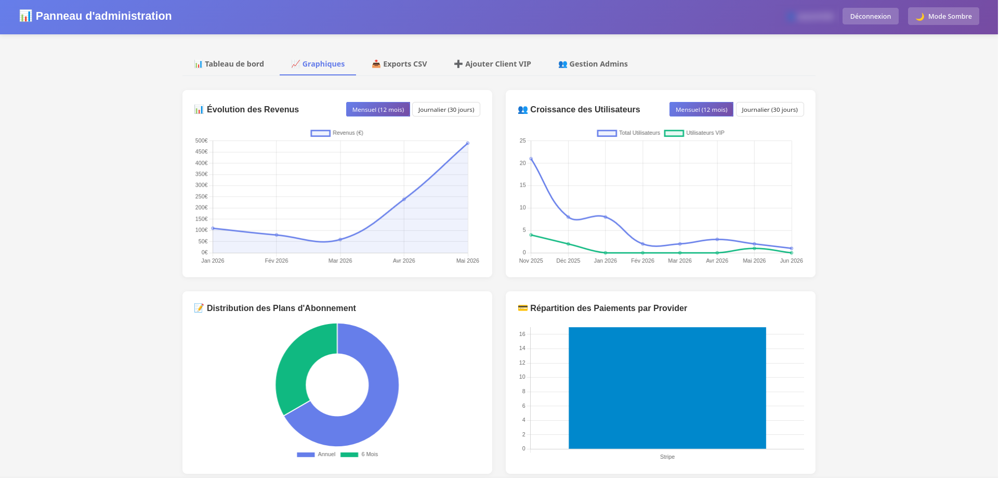
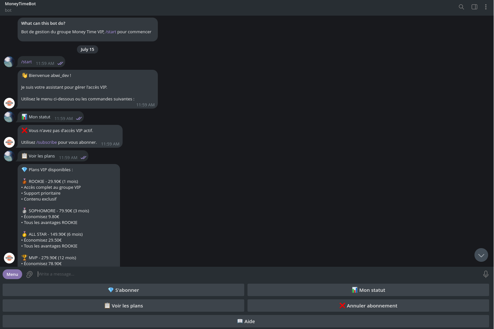
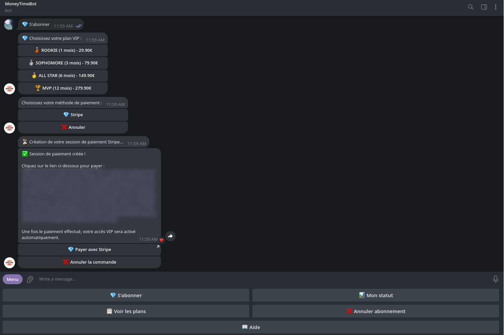

# 🤖 Telegram VIP Subscription Bot

[](https://nodejs.org)
[](https://www.typescriptlang.org/)
[](https://pnpm.io/)
[](https://opensource.org/licenses/ISC)
[](https://www.mongodb.com/)

Un bot Telegram professionnel complet en **TypeScript** conçu pour automatiser la gestion d'abonnements payants (VIP) avec intégration multi-passerelles de paiement (**PayPal, Stripe, Revolut**) et panneau d'administration interactif.

Ce projet illustre une architecture robuste, propre et modulaire, pensée pour la production (déploiement automatisé avec **Docker & Fly.io**, gestionnaire de tâches **Agenda**, journalisation rapide avec **Pino**).

---

## 📸 Aperçus du Projet

### Panneau d'Administration (Dashboard & Analytics)

*Tableau de bord principal : Vue d'ensemble des statistiques de vente, de revenus et liste de contrôle des membres VIP.*


*Section Graphiques : Suivi financier de l'évolution des revenus, croissance des utilisateurs, distribution des plans d'abonnement et répartition par provider.*

### Bot Telegram (Client)

*Menu d'accueil : Interface du bot pour l'enregistrement, la consultation de statut et la liste des offres.*


*Intégration de paiement : Sélection du moyen de paiement et génération de lien de transaction unique via Stripe.*

---

## ✨ Fonctionnalités Majeures

### 🤖 Bot Telegram (Client)
- **Abonnements Flexibles** : Gestion de plans tarifaires périodiques (Mensuel, Trimestriel, Semestriel, Annuel).
- **Auto-renouvellement (PayPal)** : Choix pour l'utilisateur entre paiement unique ou prélèvement automatique récurrent.
- **Accès Groupe VIP Automatisé** : Génération automatique de liens d'invitation uniques à usage unique lors du paiement.
- **Commandes Utilisateur** :
  - `/start` - Initialisation du compte.
  - `/subscribe` - Choix du plan d'abonnement.
  - `/status` - Vérification du statut VIP et de la date d'expiration.
  - `/plans` - Liste comparative des avantages.
  - `/cancel` - Annulation de l'abonnement récurrent.

### 💼 Panneau d'Administration (Web)
- **Analytics & Statistiques** : Suivi des ventes, revenus totaux, utilisateurs actifs et abonnements en cours via des graphiques interactifs.
- **Gestion des Utilisateurs & VIP** : Tableaux de contrôle pour ajouter manuellement un accès VIP ou révoquer un utilisateur.
- **Gestion des Moyens de Paiement** : Activer ou désactiver dynamiquement Stripe, PayPal ou Revolut directement depuis le dashboard.
- **Mode Sombre** : Interface responsive moderne avec bascule automatique/manuelle de thème (Dark Mode).

### ⚙️ Automatisation & Tâches de Fond (Scheduler)
- **Vérification d'Expiration** : Exécution automatique toutes les 5 minutes pour révoquer l'accès au groupe Telegram des membres expirés.
- **Notifications Préventives** : Relances programmées à 3 jours et 1 jour avant l'expiration de l'accès VIP.
- **Maintenance Globale** : Nettoyage quotidien des anciennes données (>6 mois) et calcul des rapports de statistiques financiers.

---

## 🛠️ Pile Technique (Tech Stack)

- **Language** : TypeScript (ES2020)
- **Framework Serveur** : Express.js (v5)
- **Framework Bot** : Telegraf.js (v4)
- **Base de Données** : MongoDB & Mongoose
- **Scheduler** : Agenda.js (basé sur MongoDB pour les tâches de fond persistantes)
- **Journalisation** : Pino & Pino-Pretty (performance maximale)
- **Paiements** :
  - **PayPal** (SDK REST + Subscriptions Webhooks)
  - **Stripe** (Checkout Sessions API + Webhooks)
  - **Revolut** (Merchant Orders API + signature Webhooks)
- **Sécurité** : Session Express (stockée dans Mongo), Bcrypt (hachage des mots de passe admin), vérification de signature des Webhooks de paiement.

---

## 📂 Structure du Projet

```text
├── .github/workflows/      # Pipelines CI/CD pour Fly.io (Production et Dev)
├── public/                 # Assets statiques pour l'interface Admin
├── scripts/                # Scripts utilitaires de configuration
├── src/
│   ├── admin/              # Routes et contrôleurs du panneau d'administration
│   ├── middleware/         # Protections de session et de rôles
│   ├── models/             # Schémas Mongoose (User, Subscription, Payment, etc.)
│   ├── payments/           # Logique d'intégration PayPal, Stripe et Revolut
│   ├── scheduler/          # Tâches Agenda (vérifications VIP, notifications)
│   ├── scripts/            # Outils CLI d'administration (seeding admin/VIP)
│   ├── telegram/           # Logique du Bot Telegram et gestionnaire VIP
│   ├── config.ts           # Validation et typage des variables d'environnement
│   └── index.ts            # Point d'entrée de l'application
├── Dockerfile              # Dockerization optimisée pour la prod
├── fly.toml                # Configuration de déploiement Cloud Fly.io
└── package.json            # Scripts de build et dépendances
```

---

## 🚀 Installation et Démarrage en Développement

### Prérequis
- **Node.js** v18 ou supérieur
- **pnpm** (installable via `npm i -g pnpm`)
- **MongoDB** (local ou cluster Atlas)

### 1. Installation des dépendances
```bash
pnpm install
```

### 2. Configuration de l'environnement
Copiez le fichier d'exemple et remplissez vos variables :
```bash
cp .env.example .env
```
*Note : Pour lancer l'application en local, seule la clé `TELEGRAM_TOKEN` et la chaîne `MONGO_URI` (ex: `mongodb://localhost:27017/tg-vip-bot`) sont requises au départ.*

### 3. Démarrage de MongoDB
Assurez-vous que votre service MongoDB local est démarré. Si vous utilisez Docker :
```bash
docker run -d --name local-mongo -p 27017:27017 mongo:latest
```

### 4. Démarrer le serveur de développement
```bash
pnpm dev
```
Le serveur Web démarrera sur `http://localhost:3000` et le bot Telegram se connectera automatiquement.

---

## 🧪 Tests et Utilitaires

Le projet inclut des scripts d'intégration pour valider la configuration :

```bash
# Vérifier la connexion à votre base MongoDB
pnpm test:db

# Lancer la suite de tests d'intégration du flux d'abonnement
pnpm test:subscription

# Créer un compte administrateur pour l'accès web
pnpm create-admin
```

---

## 🐳 Déploiement en Production

Le projet est configuré pour être déployé sur **Fly.io** avec Docker.

1. **Configurer l'App Fly.io** :
   ```bash
   fly launch --no-deploy
   ```
2. **Définir les secrets de production** :
   ```bash
   fly secrets set TELEGRAM_TOKEN="votre_token" VIP_CHAT_ID="votre_id" MONGO_URI="votre_uri" BASE_URL="https://votre-app.fly.dev" SESSION_SECRET="cle_aleatoire"
   ```
3. **Déployer** :
   ```bash
   fly deploy
   ```

*(Un workflow GitHub Actions est également configuré dans `.github/workflows/` pour déployer automatiquement sur Fly.io lors d'un push sur les branches de production).*

---

## 📄 Licence

Ce projet est disponible sous licence **ISC**.

**Développeurs** : Wassim B. & Bassem B.
